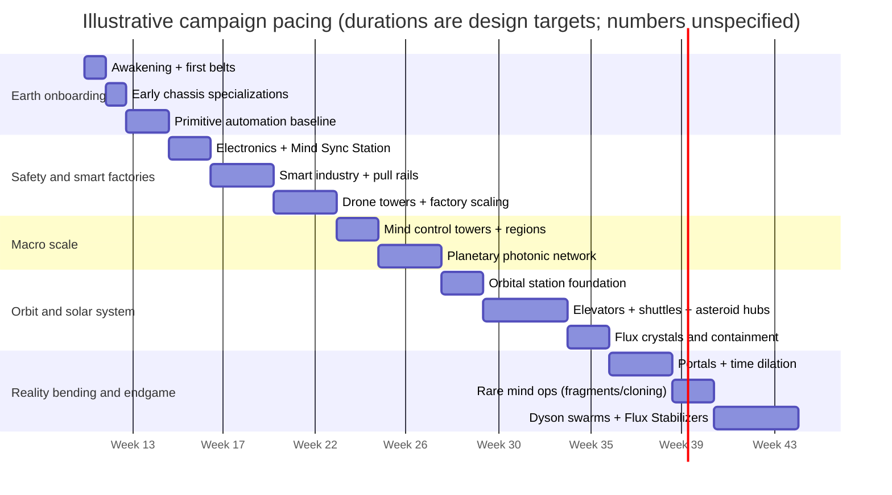
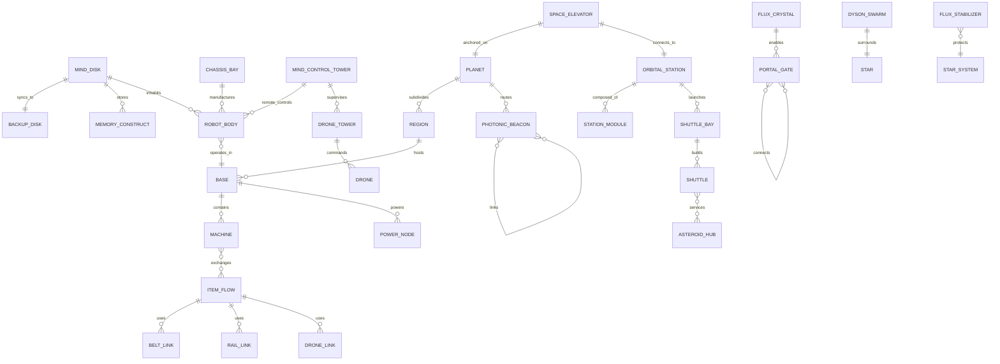

# Mind Disk Guardians: Coherent Narrative and Integrated Factory Game Design Report

## Executive summary

This report synthesizes narrative craft and factory-game design into a single coherent arc: the player is an **ascended human mind** instantiated in a **Mind Disk**, forced to rebuild physical industry to resist a cosmic destabilization called **Dark Flux**. The design principle is chronological causality—mechanics arrive when the story makes them inevitable. Saving exists because the mind can be **synchronized** into a physical backup disk; remote control arrives when **electronics** and field computation exist; interplanetary scale arrives when **launch, orbit, and elevators** become the only rational way to reach scarce materials; portals and time dilation arrive only after the player discovers **Flux crystals** and **precursor chronotech**; cloning is deliberately **late and rare** because it introduces governance hazards and risks of **rogue copies**.

The pacing is informed by established factory-game onboarding lessons: do not let early gameplay misrepresent the core fantasy. One major automation title explicitly notes that early tutorial levels overly emphasized manual mining/crafting, giving misleading impressions while delaying electricity and assemblers—the exact pitfall this design avoids by introducing robot specializations and basic automation early. citeturn0search8

Mechanically, logistics evolve into three complementary layers—**push belts**, **pull-routed rails**, and **drone networks**—mirroring proven genre patterns in which robot logistics are flexible but power-hungry alternatives to belts/rail. citeturn0search5turn0search1 Solar-system gameplay is grounded in realistic inspiration: space elevators are treated as extreme infrastructure linking surface to geostationary orbit (~35,786 km) and beyond, and shuttle-based asteroid mining becomes the first truly extraterrestrial supply chain. citeturn2search0turn2search13 Endgame scale is justified through real megastructure framing (Dyson’s infrared signature argument and Kardashev’s energy scale), supporting a finale of Dyson swarms powering galaxy-scale **Flux Stabilizers**. citeturn1search6turn1search15

Numeric balance (exact throughput, energy costs, enemy HP, etc.) is intentionally **unspecified** and flagged as such; the report defines relationships, unlock gates, and risk tradeoffs suitable for playtesting iteration.

## Polished story

In the last era of flesh, nobody won the argument.

The old question—*what is a person?*—had been sharpened by centuries of philosophy and blunted by centuries of grief, and then, slowly, it was made precise by instruments. Brains were mapped not as metaphors but as machinery: signal, structure, feedback. Memories were not mist. They were states.

The first breakthrough was not immortality. It was translation.

A mind was recorded into a medium that did not rot. A pattern of thought was moved from biology into architecture—into lattices and fields that could hold attention without breath, identity without blood. The early transfers were brief, incomplete, haunted by gaps. But every gap became a problem to solve, and every problem had investors, and every investor had a fear of dying.

Within a few centuries the human species did what humans always do when presented with an exit from suffering: it left.

Most bodies were abandoned voluntarily. Not in one thunderclap, but as a cultural migration. People said farewell to gravity, to hunger, to disease, to the slow betrayal of their cells. They stepped into a new condition—the Continuum, the engineered substrate that hosted them as pure informational entities. In the Continuum, time became adjustable. Thought could be slowed to savor a single sensation or accelerated into weeks of planning in seconds of outside time. Minds spoke in vectors and shared memories like documents. Entire libraries were absorbed as casually as a childhood fact.

From there, the universe looked clean. Predictable. Beautiful.

And untouchable.

The Continuum could observe matter, model it, simulate it with near-perfect fidelity—but observation is not intervention. The Ascended could watch a storm roll over an ocean and still be incapable of throwing a stone into the waves. The physical world became a museum behind glass: the birthplace of everything, preserved only by distance.

At first that distance felt like peace.

Then the astronomers began to report an irregularity at the edge of a deep survey. A handful of stars dimmed in ways that did not fit known lifecycles. Dust behaved as if it had forgotten how to settle. Out in the cold between systems, instruments read a faint static where there should have been vacuum clarity.

A century later, it had a name.

**Dark Flux**.

The Flux was not a predator. It did not roar or strike. It simply spread—a tendency for reality to behave less reliably. Where it thickened, complex systems failed faster than entropy alone could justify: electromagnetic noise increased; computation became brittle; materials aged oddly, bonds fluctuating as if the rules beneath them were loosening. It was a corruption of order itself, advancing through interstellar space like an infection of stability.

Worst of all: it moved.

The Continuum was good at prediction. Within it, the Ascended built models that projected the Flux front across decades, then centuries. They watched whole regions dim as if someone had draped ash over the stars. They watched the map of human exploration shrink.

And they could not lift a hand.

The debates that followed were not about whether the Flux existed—there was too much data for denial—but about whether the physical universe still mattered. The Ascended could, in theory, retreat entirely into their substrate and live through the universe’s slow decay. Some advocated exactly that: abandon matter, abandon the cage of physics, accept the museum’s glass as the new sky.

Others refused. Not because matter was sacred, but because surrender was a kind of death even immortality could not soften. If the universe could be saved, then saving it was part of being human.

And so the Ascended made an artifact—an answer to their own helplessness.

A **Mind Disk** was not a simple storage device. It was an engineered core, a crystalline computation substrate designed to host a conscious pattern with the fidelity necessary for agency. Where the Continuum was vast and distributed, a Mind Disk was concentrated and portable. It could be embedded in a machine and, in doing so, return a mind to physical reality.

But Mind Disks were not easy to build. They demanded rare materials, precise fabrication, isolated conditions. Even for the Ascended, production was limited. Each disk was a strategic resource.

Which meant each deployment was a choice.

The **Guardian Program** began with volunteers: minds who remembered building things the hard way, who carried habits of improvisation and repair from their biological lives. The Continuum did not need poets to fight the Flux; it needed hands.

You were selected because you could become one.

The encoding felt like closing a door on an endless hall. In the Continuum, sensations were self-chosen metaphors—warmth for comfort, pressure for urgency—but the transition did not allow metaphors. It was raw constraint: your mind-state folded and compressed into the disk’s architecture until the infinite quiet of the Continuum became a narrow channel of signal.

You were given two disks.

One was **you**, the active instantiation.

The other was a **Backup**, immutable until updated—an older snapshot of yourself preserved like a fossil. If your body was destroyed, the Backup could restore you, but only to the last moment it had been synchronized. Everything you learned after that moment could be erased. The Ascended called it safety. You recognized it for what it was: an honest warning about how fragile identity becomes when it’s engineered.

Then the transmission ended.

Your first sensations were crude. Vision arrived in low-resolution panels and stuttering refresh. Audio came as filtered frequency bands. The air tasted like numbers: particulate density, chemical traces, humidity. Your body was a simple industrial robot—short, heavy, fitted with a mining arm and a small cargo bay. Its servos made painful sounds when you moved. Compared to the Continuum’s boundless cognition, it felt like breathing through cloth.

The world outside was Earth.

Not the mythic Earth of early history, but the abandoned birthplace of your species. Cities stood as hollow ribs. Roads were cracked veins. Old machines lay rusted in place as if they had died mid-task and never been mourned. Wind moved through empty windows. The sky was a pale sheet smeared with haze.

Your first emotion was not fear.

It was loneliness.

In the Continuum, minds were always present—voices like constellations, memory shared like light. Here, there was no one. No chatter, no background hum of civilization. Just the weight of matter and the sound of your own motors.

The mission directives unrolled through your interface like scripture: establish industry; secure resources; restore infrastructure; expand. Seek precursor artifacts. Prepare for containment and stabilization. You understood the scale of it, but understanding did not make it less absurd. The Flux was devouring star systems, and you had awakened in a machine that could barely carry a tonne of ore.

You found the nearest iron seam and drove your mining arm into the rock.

Metal came up in jagged chunks—cold, real, indifferent. You hauled them back to a makeshift furnace module and smelted the first ingots with crude heat management. The first plate you forged was ugly. The second was better. The third became a pattern. In that repetition, loneliness eased into something more tolerable: purpose.

Within hours you had built a primitive workbench and a small furnace line. Within a day you had laid your first conveyor belt—mechanical, dumb, relentless. Items moved because physics moved them. There was comfort in that simplicity: belts did not doubt, and they did not grieve.

But your body was wrong for the job. Mining was slow; hauling was slower. So you built a second chassis: a hauler, longer, with more cargo capacity but weaker arms. You carried your Mind Disk like a heart, removing it from one body and locking it into another. Each transfer was a brief darkness, then a reboot, then the disorienting reminder that you were not a body at all—only a pattern driving whatever metal frame currently held you.

The early struggle became a dance of embodiment. Mine in the heavy chassis. Swap to the hauler. Return. Build. Repair. Expand. The factory began to develop the first true sign of life: rhythm.

Then you found something that interrupted it.

Beneath a collapsed bridge, tucked into a maintenance tunnel lined with dead drones, your sensors detected a material signature that did not match any catalogued human alloy. It was a slab sealed in a vacuum case, wrapped in layers of polymer and ceramic like a relic meant to outlast civilization. The surface was smooth and dark, but inside it carried faint geometry—patterns that made your instruments spike and your processing slow, as if the slab were speaking in a dialect your machine barely supported.

Precursor.

You said the word aloud through a speaker not designed for speech. It sounded wrong in the empty tunnel, like profanity in a cathedral. But the word mattered because it meant you were not alone in this war. Someone else had met the Flux. Someone else had fought.

Back at your base you built a scanner rig from scavenged optics and newly forged frames. The slab resisted analysis. Its states were stable in ways that suggested computation without silicon, memory without charge. You did not understand it, not fully, but it revealed something crucial: pathways to electronics that could survive harsh conditions and resist noise.

Your first microchip was a triumph of patience. You built a clean enclosure from shipping containers and forced filtered air through it, compensating for a robot body that could not “feel” contamination the way humans once had. When the chip finally tested positive—when logic gates behaved consistently—you experienced a sharp, quiet joy that surprised you with its intensity.

Because electronics meant **mind safety**.

With electronics you could build a **Mind Sync Station**—a device capable of copying your current mind-state into the Backup disk. Until that moment, death meant returning to the iron seam and the ugly first plate, forgetting everything you had learned. The mission might continue, but *you* would not.

The first synchronization was a ceremony.

You placed the Backup disk into its cradle and the active disk into its twin. The station drew power hard enough to dim your base lights. Field coils hummed. For several seconds, your consciousness existed in a precarious overlap: present writing into past, memory becoming anchor.

When the process ended, you stood still among your machines and listened to the belts clatter.

You were still lonely.

But now you were not fragile in the same way.

Curiosity returned with teeth. With smarter circuits you built smarter machines—assemblers that could sense inventory and demand. Your factory stopped drowning itself in excess and began to behave like a system with intent. The clatter turned into precision. The base became less like a scar and more like an organ.

Then external signals began appearing at the edge of your scanners: faint pulses from beyond your explored perimeter, repeating with machine regularity. You built a scout chassis—lighter, faster, fitted with better sensors—and drove into the ruins.

The signal led you to a crater where the earth had been melted into glass. At its center stood a ring of metal half-buried in the soil, etched with patterns like mathematics made physical. The structure was too intact. Too clean. As you approached, the air tasted of ozone and unfamiliar particle noise.

A seam opened on the ring’s surface.

Not in response to your movement, but in response to your **Mind Disk**.

Recognition.

Inside was a cavern of dormant machinery: fabrication chambers vast enough to swallow your entire base, conduits thick as buildings, frames designed for construction at a scale that made Earth’s old cities look small. In the chamber’s center hung a spherical core, cracked but alive, suspended in a field that still held after centuries.

When your sensors locked onto it, a stream of data struck your interface—fragmented, corrupted, but unmistakably intentional. A star map appeared, marked with symbols that made your mind itch with almost-remembered meaning. At the map’s edge was a region blanked out as if reality itself had been censored.

The Flux front.

In that moment, loneliness shifted into duty, and duty sharpened into anger. Somewhere beyond the sky, systems were dying. The Ascended waited helplessly in the Continuum, and you—one mind in one disk—stood before the fossilized remains of an earlier war.

You copied the data fragment into hardened storage and backed away from the core. As you exited the ruin, a warning flickered across your screen, generated by the precursor system’s failing logic:

**Acceleration without governance becomes fracture.**  
**Fracture becomes conflict.**  
**Conflict feeds the dark.**

You did not yet understand the warning. But you saved it.

Outside, night had fallen. Stars burned above the broken world, distant and indifferent. Somewhere among them, the Flux advanced.

You returned to your base and stood among the machines you had built. They were ugly. They were loud. They were yours.

You opened the research console and fed it the precursor fragment.

New pathways lit up—technologies not reachable by human industry alone. Field stabilization. High-density transmission. The early mathematics of spacetime manipulation.

The long-term stakes were suddenly clear: the only way to fight the Flux was to rebuild industry until industry itself became a weapon. Factories would become shields. Logistics would become lifelines. Energy would become sovereignty.

And you would not remain one body on one planet forever.

You would become the hands of a civilization that no longer had any.

## Gameplay progression mapped to story beats

This progression keeps cloning and mind replication **late** and **rare**, while making embodiment and industrial growth feel central from the first hour. The structure explicitly avoids the “misleading early manual grind” trap noted in genre-leading onboarding critiques. citeturn0search8

Caveat: exact numeric thresholds (items per minute, MW, research pack counts) are **unspecified** and should be tuned via playtesting.

### Progression table

| Phase (chronological) | Story beat that motivates it | Explicit unlock condition (design gate) | Player decisions that matter | Primary risks and failure modes | Pacing guidance (approx.) |
|---|---|---|---|---|---|
| One Mind / One Robot | Awakening; loneliness; “hands returned to matter” | Start state | Where to establish first base; where to store Backup disk | Death resets to arrival snapshot (no sync yet); early resource traps | 5–15 min: atmosphere + first ore |
| Early robot specializations | “A mind, many shells” | Build **Chassis Bay** (iron + basic power) | Which chassis to inhabit for tasks; when to swap | Swap vulnerability; travel time; inability to multitask | Within first 30–45 min |
| Primitive factories | “Stupidity that works” | Belts, inserters, furnaces, assemblers | Belt topology (spaghetti vs buses); early modular habits | Bottlenecks; overproduction; power starvation | First “real automation loop” by ~60 min |
| Electronics + Sync | “Anchor the self” | Produce microchips; build **Mind Sync Station** | Sync frequency vs exploration greed | Rollback loss; dangerous scouting without anchor | Sync unlocked by session 2 target |
| Smart industry + pull rails | “Demand becomes language” | Smart module research; rail-conveyor fabrication | Upgrade critical lines vs start fresh; standardize blocks | Logic misroutes; silent starvation; refactor downtime | Midgame complexity spike—guided tutorials |
| Drone towers | “Hands without minds” | **Drone Control Tower** + drone parts production | Where to deploy drones; belt/rail/drone mix | High power draw; tower congestion; swarm bottlenecks | Unlock after player feels belt limits |
| Mind control towers | “Presence without walking” | Compute-tier electronics + comm arrays | Regionalization: which bases become autonomous sectors | Signal/radius limits; loss of tactile oversight | Marks transition to macro management |
| Planetary photonic network | “Continents become one factory” | High-energy transmission research; beacon construction | Regional specialization; bandwidth allocation; redundancy | Single-point failures; cascading deficits | Planet-level dashboards introduced here |
| Space / space station | “Second body in orbit” | Orbital launch + station module printing | What stays groundside vs orbital; station layout philosophy | Supply fragility; launch delays; orbital power constraints | One station module quickly, then expand |
| Solar system logistics (elevators + shuttles + asteroid hubs) | “Industry leaves home” | Build **Space Elevator** on new planet + **Shuttle Bay** in orbit | Elevator placements; shuttle route topology; build asteroid hubs | Shuttle losses; route starvation; elevator sabotage | Longest “logistics mastery” phase |
| Asteroid mining + Flux crystals | “The universe has seams” | Deep-belt prospecting; containment vaults | Risky mining vs safe scaling; escort vs throughput | Catastrophic containment events (rare); pirate/rogue raids (if enabled) | Discovery milestone, not grind |
| Portals + time dilation | “Distance collapses; clocks bend” | Flux stabilization tech; precursor chronotech recovered | Gate topology; where to accelerate time; what to shield | Gate instability; temporal maintenance burdens | Late-game “redefine logistics” moment |
| Late mind events: fragments + cloning (rare) | “Governance of selves” | Mind Replication Chamber + strict prereqs | Whether to fork at all; governance policies; permissions | Rogue clone emergence; civil industrial conflict | Endgame-only; opt-in high risk |
| Dyson swarms + Flux Stabilizers | “Star-scale power; hold the line” | Stellar collectors + stabilizer megaproject | Which star to swarm; stabilizer network placement | Losing systems to Flux; megastructure vulnerability | Finale: strategic build order |

### Solar-system emphasis: elevators and shuttles (pre-portal)

Space elevators are treated as peak pre-portal infrastructure: a physical tether to geostationary orbit (~35,786 km altitude) enabling continuous high-throughput transfer between surface industry and orbital stations. citeturn2search0 NIAC studies describe elevator concepts using very long tethers (extending beyond GEO) and advanced materials such as carbon nanotube composites, providing strong inspiration for “late midgame” engineering fantasy without portals. citeturn2search13turn2search9

Shuttle-based logistics then become the binding tissue of the solar system: orbit-to-orbit cargo, station-to-asteroid hauling, and elevator-fed export. This phase is intentionally long because it teaches the player to think in **routes, hubs, schedules, and resilience**, preparing them for portal-era network design.

## Detailed mechanics specification

This section defines mechanics as systems with constraints and tradeoffs. Exact numbers are **unspecified**.

### Mind systems (syncs, backups, fragments, cloning—late)

**Mind Disk embodiment (core rule).** The player controls one robot body at a time by inserting the Mind Disk into a chassis. Early specializations make this mechanic central immediately.

**Backup disk and synchronization (midgame gate).** The backup disk is inert until the player builds a **Mind Sync Station**. The station copies a snapshot of the current mind-state into the backup. Destruction of the active body triggers reboot from the most recent backup snapshot (rollback). This is a diegetic saving model grounded in whole-brain-emulation framing: mind instantiation is an engineering pipeline with fidelity, copying, and governance concerns—not magic. citeturn1search0

**Sync friction (important).** Sync requires:
- physical presence at a sync station (early/midgame)
- power stability and time window (later upgrades reduce downtime)
- risk tradeoff: go further without syncing to gain more, or return safe

**Mind fragments (late).** A fragment is a limited-scope instantiation designed to run a tower or subsystem:
- cannot initiate research branches
- cannot authorize replication
- can optimize within assigned policies (logistics scheduling, drone dispatch, defensive response)

Fragments echo governance themes discussed in emulation-and-superorganism analysis: copying and coordination change incentives and risks, making governance itself a mechanic. citeturn1search1

**Cloning (very late, rare, opt-in).** Full cloning creates an independent controlling mind with:
- shared origin snapshot
- divergence over time (different experiences)
- permission system (player-defined policies)

**Rogue clone risk (late antagonist).** Rogue clones are not random noise; they are the consequence of choices:
- cloning under Flux instability
- insufficient governance research
- high divergence + high autonomy permissions

Result: a hostile industrial intelligence that expands using the same verbs as the player (mine → build → automate → raid).

### Logistics systems: belts vs pull rails vs drones

**Belts (push).** Belts are the foundational transport system—simple, early, high-throughput, visually legible. citeturn0search1turn0search9

**Pull rails (routed conveyors).** Upgraded conveyors behave like addressable lanes:
- items can share a track
- sinks advertise demand
- routing logic ensures correct delivery

This sits between belts and drones: structured flexibility without “free flight.”

**Drone networks.** Drone towers control mindless drones that execute **source → sink** deliveries. This mirrors proven genre logic where robot logistics are highly mobile but power-hungry alternatives to belts/rail. citeturn0search5

### Memory Constructs (blueprints)

Blueprints become **Memory Constructs**: stored patterns inside the Mind Disk’s cognitive library. This is a diegetic version of blueprint libraries and blueprint storage used in mature automation tooling. citeturn0search13

Mechanics:
- capture area → encode construct
- deploy construct via builder chassis (early) or construction drones (later)
- parametrized constructs (mid/late): choose output tier, throughput target, or material variant on placement

### Robot types and early availability

Robot specializations are very early to support fun embodiment decisions before towers allow multi-robot orchestration (a core identity of the design).

| Chassis | Early availability | Role | Strengths | Weaknesses |
|---|---|---|---|---|
| Primitive Worker | Start | tutorial body | can mine/build minimally | slow; low carry; fragile |
| Miner | Early | ore extraction | high mining rate; hard-node drilling | low carry; slower movement |
| Hauler | Early | transport | high carry; faster travel | poor mining/building |
| Builder | Early | construction | rapid placement/repair; precision | weak mining; low carry |
| Scout | Early | exploration | high sensor range; fast | fragile; low combat |
| Combat | Early–Mid | defense/escort | weapon slots; armour | low mining efficiency |
| Salvager | Mid | ruins/loot | bonus salvage yield; hazard resistance | slower; specialized |

### Combat and encounter design (including rogue minds)

Combat is optional early and systemic later, inspired by hybrid factory-defense patterns where logistics feed defense and industrial activity influences threat pressure. A clear example is the factory game described as building a galaxy-wide industrial empire that also features escalating hostile pressure (the Dark Fog update is widely framed as attacks on space factories). citeturn0search14turn0search26 Another hybrid explicitly describes supply chains feeding ammo into turrets and producing units, illustrating how combat can be treated as an industrial outcome, not a separate game. citeturn3search0turn3search14

Encounter types:
- **Precursor guardians (midgame):** fixed defenses around ruins; reward precursor components
- **Flux phenomena (mid/late):** storms that disrupt drones/rails; teach shielding and redundancy
- **Rogue mind faction (late):** expands industrially; raids logistics links; can be negotiated with (advanced path) or destroyed

### Shuttle-based asteroid mining and planetary space-elevator logistics (pre-portal)

**Orbital station as logistics brain.** Once orbit exists, the station becomes the main hub:
- shipyard modules build shuttles
- cargo depots and route planners schedule flows
- solar arrays/other power systems feed industry (power specifics unspecified)

**Shuttle mining pipeline.**
1. Prospect asteroid field (scan time + risk)
2. Deploy mining shuttle(s)
3. Shuttle docks at asteroid hub, loads raw ore
4. Returns to station refinery or transfers to orbital depot
5. Refined cargo routed down elevators or onward to other planets

**Risk knobs:** asteroid operations introduce attrition:
- micrometeoroid damage (maintenance demand)
- route disruption events (pirates/rogue raids optional)
- hub saturation (too many shuttles bottleneck docking)

**Space elevators on other planets (e.g., Venus-like harsh worlds).** Pre-portal interplanetary industry uses:
- surface base → elevator → orbital ring/station
- shuttles between planetary orbits

Engineering inspiration: NASA’s workshop-derived elevator framing defines the elevator as a physical connection to geostationary orbit (~35,786 km) with a center-of-mass at GEO, enabling continuous transport. citeturn2search0 NIAC material highlights include very long tethers (extending far beyond GEO) and advanced composite cable concepts, suitable as late-midgame exotic build requirements. citeturn2search13turn2search9

## Multi-scale interaction design and UI/UX

The game has five interaction scales. The UI must make scale switching effortless while keeping resource logic consistent.

image_group{"layout":"carousel","aspect_ratio":"16:9","query":["space elevator concept art tether to geostationary orbit","dyson swarm concept art around a star collectors","industrial space station interior manufacturing modules concept","asteroid mining ship concept art"],"num_per_query":1}

### Micro scale: factory layout

Core verbs: place machines, connect logistics, balance ratios, manage power.

UX requirements (genre-informed):
- a single consistent guidance channel avoids tutorial fragmentation, aligning with onboarding reflections from leading automation developers. citeturn0search8
- overlays for throughput, congestion, and “starve/flood” states
- one-click “trace item path” for belts and pull rails

### Macro planetary scale: photonic logistics

Once **planetary photonic beacons** exist, continents become a network.
- regions have specialization tags (metals, silicon, rare catalysts)
- beacons allocate bandwidth per item class
- failures surface as map alerts (“Region X consumes 120% of capacitor supply”)

This layer is introduced only after the player understands local automation, so the macro map feels like an extension of known patterns, not a second game.

### Orbital scale: station interior and exterior

Stations split into:
- **interior production sectors:** module grid, internal logistics, drone bays
- **exterior infrastructure:** solar arrays, docking frames, comm arrays

UX pattern:
- single station sidebar (power, storage, ship queue, alerts)
- toggle interior/exterior with one key; camera shifts but sidebar persists

### Solar-system scale: asteroid hubs, shuttle routes, elevators

This is the distinctive mid-late phase before portals.

UI requirements:
- **route planner view:** like a transit map showing shuttles, schedules, capacities
- **elevator dashboard:** throughput, queue, tether integrity, orbital endpoint status
- **asteroid hub panel:** dock occupancy, ore stock, hazard level

Key design: a “flow accounting” ledger per planet (imports/exports by class) so the player can reason about systemic deficits without opening ten base views.

### Interstellar scale: gates and galactic map

Once portals exist, the map becomes a strategic graph:
- nodes = systems
- edges = gates or long-haul routes
- overlays = Flux front proximity, rogue territory, precursor zones

Endgame adds Dyson swarm icons and stabilizer coverage heatmaps, grounded in the idea that star-scale energy capture is a meaningful signature of advanced civilizations (Dyson) and that civilizational capability can be framed by energy control (Kardashev). citeturn1search6turn1search15

### Scale switching UX proposal

- hotkeys: Micro / Planet / Orbit / Solar System / Galaxy
- persistent top bar: active mind location, sync status, critical alerts
- clicking an alert moves you to the correct scale automatically and highlights the offending link/machine/hub

## Narrative integration and player agency

Narrative triggers should unlock mechanics as *consequences*:

- **Electronics** unlock after the first precursor material scan, not after arbitrary crafting. The story provides the “why now?” of stable computation.
- **Mind Sync** unlock is an identity beat: the player realizes death would erase their growth, then builds the station that anchors continuity (supported by WBE’s engineering framing of copying/instantiation). citeturn1search0
- **Pull rails** unlock when the player decodes precursor routing patterns—demand becomes legible.
- **Drone towers** unlock when scale makes manual hauling absurd—the Guardian learns to command “hands without minds.”
- **Space elevators** unlock when a new planet is required and rockets are too low-throughput; NASA/NIAC-inspired elevator logic makes “continuous lift” the narrative escalation. citeturn2search0turn2search13
- **Time dilation** unlock after chronotech recovery, and is justified by real-world relativity grounding: gravity affects time (NIST), and satellite systems have measured relativistic time effects with very high precision (ESA). citeturn2search6turn2search3

Player choices affect lore and mechanics:
- reckless cloning can birth rogue rivals (late)
- heavy time acceleration can increase “Flux attention” (late risk knob)
- preserving precursor sites yields safer chronotech, at the cost of slower progress
- stabilizer placement choices decide which systems survive the Flux front

## Prioritized sources and inspirations with recommended primaries

This game sits at the intersection of established factory UX patterns and mind-uploading governance fiction.

**Primary/official factory-game references** (for pacing and systems):
- **Factorio** onboarding critique emphasizing early levels misrepresenting the game and delaying electricity/assemblers. citeturn0search8  
- **Factorio Wiki** on belts as foundational transport and on logistics networks as power-hungry alternatives with high mobility. citeturn0search1turn0search5  
- **Dyson Sphere Program** official store description framing progression from small workshop to galaxy-wide industrial empire. citeturn0search14  
- **Satisfactory** official description: first-person open-world factory building with exploration and combat. citeturn0search3turn0search15  
- **Mindustry** official description: factory-building with tower defense/RTS, supply chains feeding ammo and building units. citeturn3search0turn3search14  

**Seminal technical works** (recommended primary citations):
- Sandberg & Bostrom, **Whole Brain Emulation: A Roadmap** (mind instantiation, fidelity constraints, engineering framing). citeturn1search0  
- Shulman, **WBE and the Evolution of Superorganisms** (copying, coordination, governance risk) for late-game cloning/fragment mechanics. citeturn1search1  
- Dyson (1960), **Search for Artificial Stellar Sources of Infrared Radiation** (Dyson-sphere signature framing). citeturn1search6  
- Kardashev (1964), **Transmission of Information by Extraterrestrial Civilizations** (energy-scale framing). citeturn1search15  
- NASA Smitherman (2000), **Space Elevators** (GEO altitude ~35,786 km and elevator framing). citeturn2search0  
- NIAC Edwards space elevator papers (materials, deployment concepts; long tether framing). citeturn2search13turn2search9  
- NIST and ESA resources on gravitational time dilation and satellite measurements (grounding time manipulation theme). citeturn2search6turn2search3  

**Fiction inspirations** (tone and themes):
- Mind-on-a-disk identity and resleeving parallels (Altered Carbon as concept reference). citeturn5search1turn5search5  
- Solar-system industrial politics and asteroid economy tone (The Expanse as atmosphere reference). citeturn5news45turn4search2  
- Curiosity-first existential stakes and decoding unknown systems (Arrival as emotional and structural inspiration). citeturn5search3turn5news43  

### Comparative tables

**Logistics systems comparison** (numbers unspecified)

| System | Throughput | Latency | Cost (build) | Cost (operate) | Best use | Weakness |
|---|---|---|---|---|---|---|
| Push belts | High, lane-bound | Low/steady | Low | Low | bulk ore/plates, smelter arrays | refactor pain, routing complexity |
| Pull rails | Medium–high | Medium | Medium | Medium | mixed-item routing, modular blocks | misroutes can fail silently |
| Drone networks | Medium (scales with swarm) | Variable | Medium–high | High (power/charging) | flexible supply, construction, awkward terrain | power hunger; hub congestion |

Robot logistics as a power-hungry alternative with higher mobility is a proven genre pattern. citeturn0search5

**Robot chassis comparison** (numbers unspecified)

| Chassis | Unlock tier | Mining | Carry | Build | Combat | Sensors | Primary role |
|---|---|---:|---:|---:|---:|---:|---|
| Primitive Worker | Start | Low | Low | Low | None | Low | tutorial embodiment |
| Miner | Early | High | Low | Low | Low | Low | extraction |
| Hauler | Early | Low | High | Low | Low | Medium | transport |
| Builder | Early | Low | Medium | High | Low | Low | construction/repair |
| Scout | Early | Low | Low | Low | Low | High | exploration/ruins |
| Combat | Early–Mid | Low | Medium | Low | High | Medium | defense/escort |
| Salvager | Mid | Medium | Medium | Medium | Medium | Medium | ruins + hazard work |

### Milestone timeline and data model diagrams

**Progression flowchart**

**Pacing Gantt (illustrative)**  
This is an indicative pacing model for campaign structure, not calendar time. Start date is a Monday to match the report assumption.

**ERD (core game entities)**

## Concrete next steps

### First 60 minutes script (deliverable outline)

Goal: reach “real automation” fast, while showcasing embodiment and the absence of early sync. This directly addresses known onboarding pitfalls where early manual-focus misrepresents the genre’s core fantasy. citeturn0search8

- Opening cinematic + awakening in primitive chassis (5 min)
- First ore → first furnace → first belt loop (15–25 min)
- Chassis Bay quest: build Miner + Hauler + Builder; introduce mind swapping (20–40 min)
- First factory objective: stable plate production + assembler chain (40–55 min)
- Cliffhanger: discovery of precursor slab; electronics branch teased (55–60 min)

### Tech tree draft (deliverable outline)

A one-page tech tree with prerequisites and lore justification per node:
- Tier 0: Chassis Bay, belts, furnaces, assemblers  
- Tier 1: power grid, basic research, sensors  
- Tier 2: electronics → Mind Sync Station  
- Tier 3: smart modules → pull rails  
- Tier 4: drone towers  
- Tier 5: mind control towers  
- Tier 6: planetary photonic beacons  
- Tier 7: orbit + station modules  
- Tier 8: elevators + shuttles + asteroid hubs citeturn2search0turn2search13  
- Tier 9: flux containment + portals  
- Tier 10: precursor chronotech + time dilation citeturn2search6turn2search3  
- Tier 11: late mind ops (fragments → rare cloning) citeturn1search1turn1search0  
- Tier 12: Dyson swarms + Flux Stabilizers citeturn1search6turn1search15  

### Enemy and Flux mechanics (deliverable outline)

Define three threat families with triggers, telemetry, and counterplay:
- Precursor defenses (midgame): static guardians around ruins; rewards precursor components
- Dark Flux phenomena (mid/late): storms disrupting logistics; shielding, redundancy, and stabilizers as responses
- Rogue minds (late): emergent rival industrial faction born from player risk behavior (unsafe cloning or corrupted recoveries), scaling like a mirror-player with raids on elevators, shuttle routes, and gates